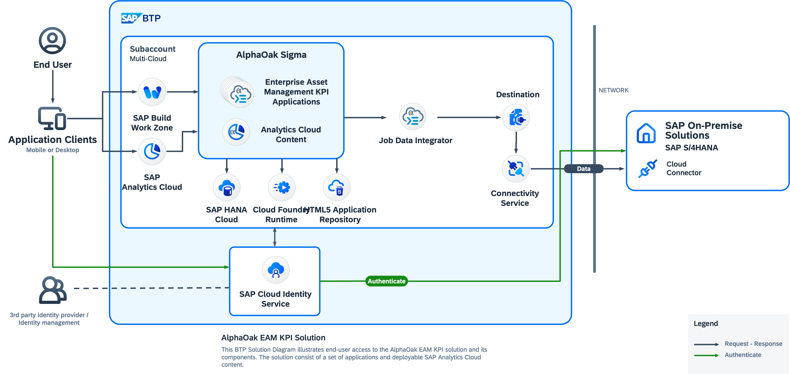

# reCAP Conference 2025
AlphaOak is developing a SAP extension app called ['Sigma'](https://www.alphaoak.com/products/sigma/) that is using S/4 as a foundation 

## System Landscape



# Sigma Structure Overview

```
                        +-----------------+                                                                                                                                                
                        | @alphaoak/sigma |                                                                                                                                                
                        +--------|--------+                                                                                                                                                
                                 |                                                                                                                                                         
           +---------------------|                                                                                                                                                         
           |                     |                                                                                                                                                         
           |                     |                                                                                                                                                         
           |          +--------------------+                                                                                                                                               
           |          | @alphaoak/eam-kpis |                                                                                                                                               
           |          +----+---------------+                                                                                                                                               
           |                     |                                                                                                                                                         
           |                     |-------------------------------------------------------------------------------------------------------+---------------------------+                     
           |                     |                |                         |                             |                              |                           |                     
           |                     |    +-----------|-----------+ +-----------|----------+   +--------------|-------------+ +--------------|--------------+ +----------|---------+           
           |                     |    | @alphaoak/eam-quality | | @alphaoak/eam-safety |   | @alphaoak/eam-customer-sat | | @alphaoak/eam-cost-burdened | | @alphaoak/workdate |           
           |                     |    +-----------|-----------+ +-----------|----------+   +--------------|-------------+ +--------------|--------------+ +--------------------+           
           |                     |                |                         |                             |                              |                                                 
           |                     --------------------------------------------------------------------------------------------------------+                                                 
           |           +--------------------+                                                                                                                                              
           |           | @alphaoak/eam-core |                                                                                                                                              
           |           +--------------------+                                                                                                                                              
           |                     |                                                                                                                                                         
           |                     |                                                                                                                                                        
           |                +----------------------------------------------------+                                                                                                         
           |                |                         |                          |                                                                                                         
           |       +--------------------+ +-------------------------+ +---------------------+                                                                                              
           |       | @alphaoak/cds-core | | @alphaoak/material-core | | @alphaoak/cost-core |                                                                                              
           |       +--------------------+ +-------------------------+ +---------------------+                                                                                              
+----------|----------+                                                                                                                                                                    
| @alphaoak/cds-utils |                                                                                                                                                                    
+---------------------+                                                                                                                                                                                                    

```


# Example Plugin Use for Semantics
## Why using Plugins
We are using plugins to separate the different data models and extensions from each other. The easiest analogy would be modules in SAP S/4.


